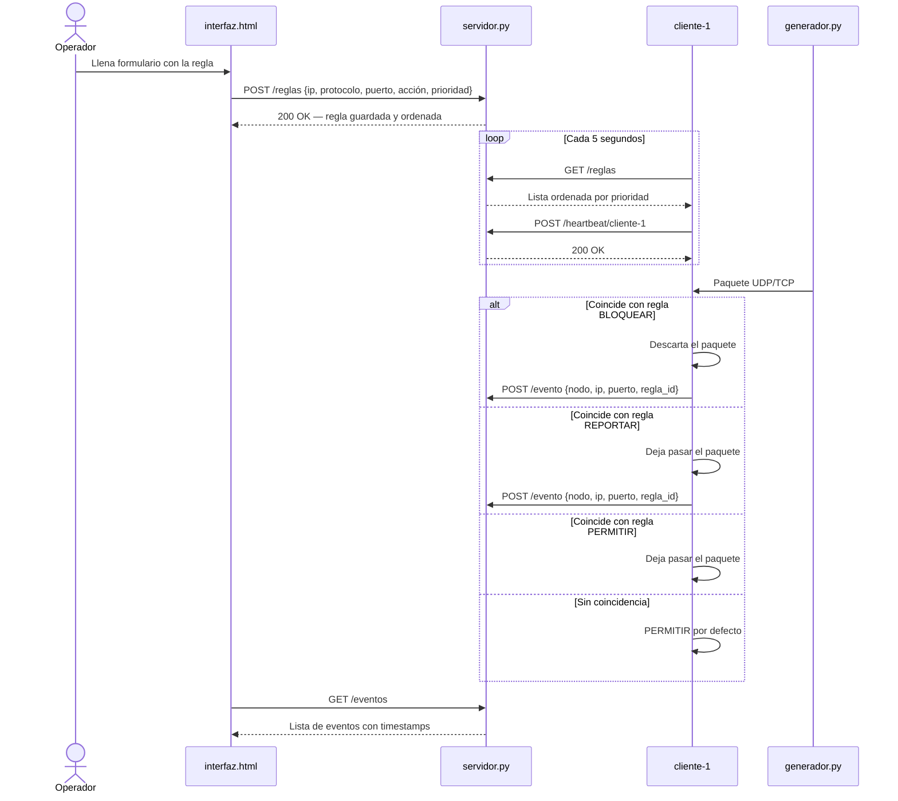
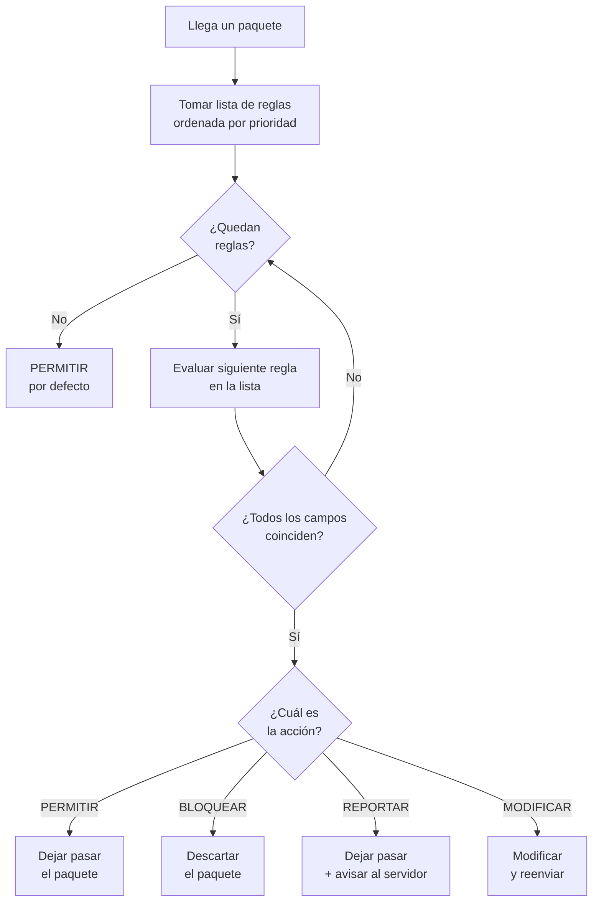
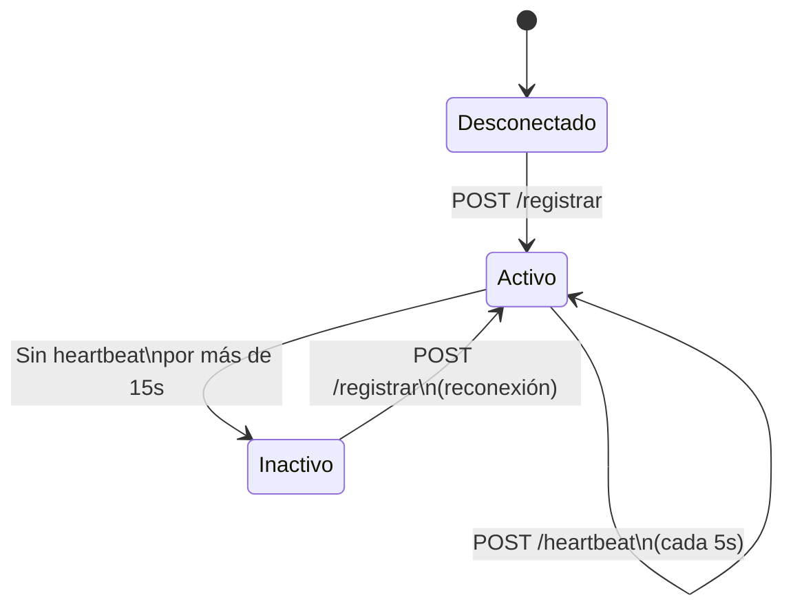
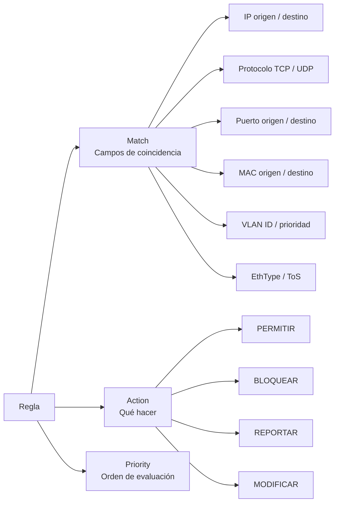

## Separación de planos

| Plano | Componente | Rol |
|---|---|---|
| **Control** | `servidor.py` + `interfaz.html` | Almacena reglas, registra nodos, recibe eventos |
| **Datos** | `cliente.py` (×3) | Escucha tráfico, evalúa reglas, aplica acciones |
| **Pruebas** | `generador.py` | Produce tráfico UDP/TCP configurable |
| **Análisis** | `analizador.py` | Captura y estadística de tráfico con Scapy |

---

## Cómo se ven las reglas en nuestro proyecto

---

## Pseudocódigo de lógica de prioridad

---

## Gestión de nodos — heartbeat

---

## Estructura de una regla

Cada regla tiene tres partes, igual que en OpenFlow real:

---

## Cumplimiento del enunciado

| Requisito | Implementación |
|---|---|
| Registrar clientes | `POST /registrar` → guarda en `data.json` |
| Lista de nodos con estado | `GET /nodos`.  id, IP, estado, última conexión |
| Detectar nodos caídos | automático PORQUE revisa heartbeat cada 5s |
| Almacenar y distribuir reglas | `POST /reglas` y `GET /reglas` ordenadas por prioridad |
| Recibir eventos de clientes | `POST /evento`, guarda con timestamp |
| Logs y evidencia | `logs.txt` con timestamp en cada operación |
| Persistencia | `data.json` |
| Cliente replicable | Mismo `cliente.py` en todos los PCs, solo cambia `config.json` |
| Evaluación de tráfico | `evaluar_paquete()`, primera coincidencia por prioridad gana |
| Acciones obligatorias | PERMITIR, BLOQUEAR y REPORTAR implementadas y probadas |
| Generador configurable | `--ip --puerto --cantidad --intervalo --mensaje --protocolo` |
| Interfaz de administración | Tabla de flujo, interpretación automática, pseudo-OpenFlow |
| Analizador de tráfico | Scapy — captura real, estadísticas cada 10 segundos |

---

**¿Por qué Flask y no FastAPI?**  
Flask es muuucho más fácil y directo. El código es más
legible y fácil de explicarle al profe. 

**¿Por qué HTTP/REST y no OpenFlow real?**  
OpenFlow requiere switches físicos compatibles. HTTP/REST permite demostrar
los mismos conceptos de separación de planos sobre cualquier red WiFi o
Ethernet sin hardware especializado.

**¿Por qué configuración separada del código?**  
Para cumplir el principio de replicabilidad SDN. El mismo `cliente.py` corre
en todos los PCs, solo cambia `config.json`. Esto demuestra que el sistema
escala a N clientes sin modificar código.
